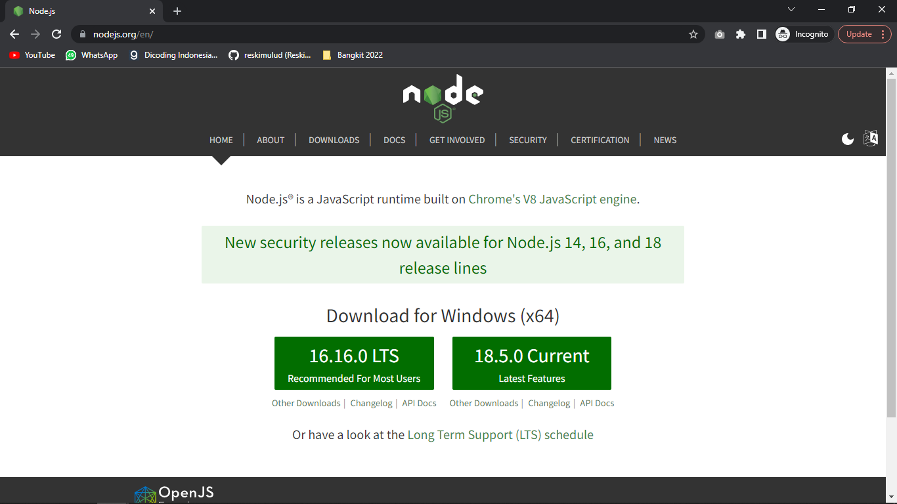
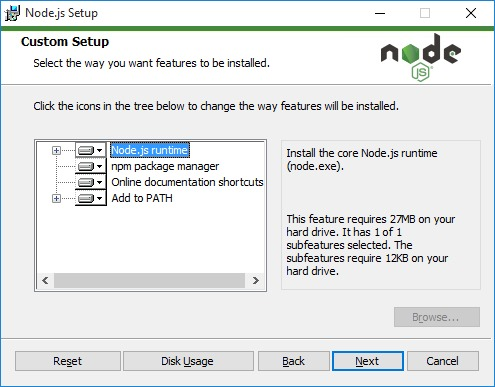
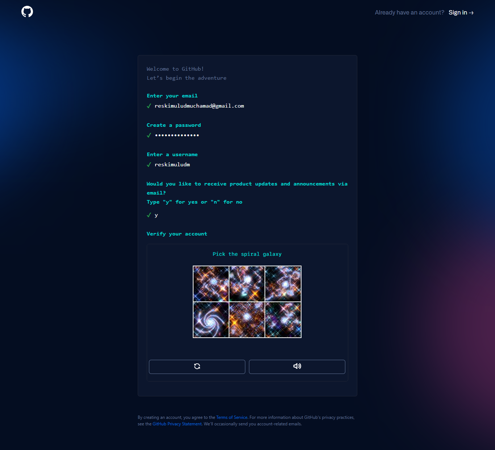
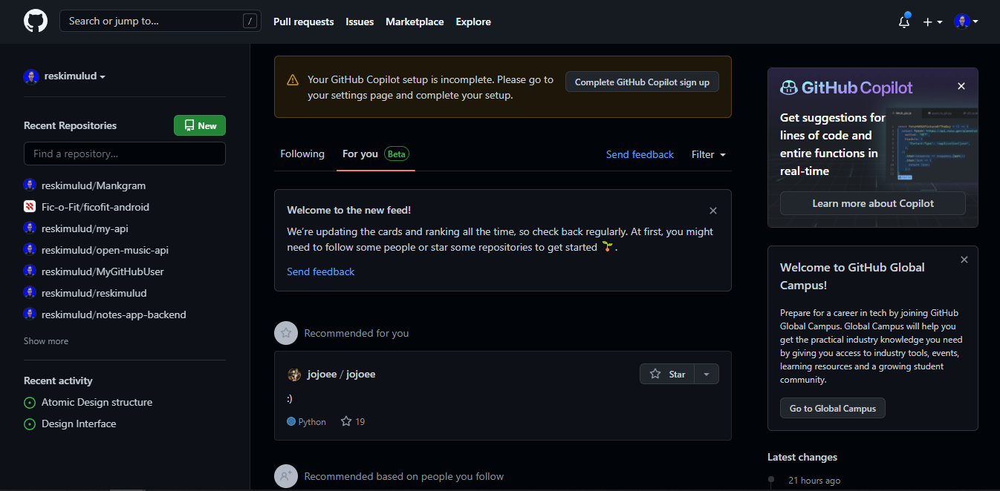
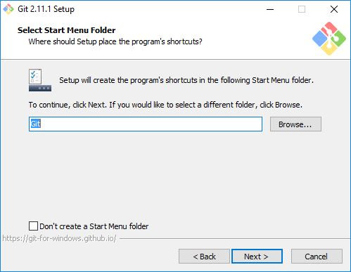

# Persiapan dan Instalasi

Di modul ini akan dijelaskan panduan bagaimana cara menginstall tools-tools yang sudah dijelaskan di modul sebelumnya, juga akan dijelaskan untuk pembuatan akun dari platform tersebut. Tidak perlu berlama-lama, mari kita ikuti langkahnya satu-persatu.

# Instalasi Node.JS

Pertama, kunjungi web [nodejs.org](https://nodejs.org) lalu unduh Node.JS versi LTS (Long Term Support)



Setelah berhasil mengunduh, buka berkas yang baru saja diunduh dan ikuti instruksi yang diberikan.


Pada bagian selanjutnya, kita juga dapat melihat komponen apa saja yang akan diterapkan (bundling) dalam pemasangan node.js ini.



Lalu ikuti instruksi selanjutnya dan tunggu proses instalasi hingga selesai. Jika instalasi selesai dan berhasil, maka pesan seperti ini akan tampil.


Untuk memastikan bahwa Node.JS telah terinstal, jalankan perintah berikut di CMD atau PowerShell

```bash
node --version
npm --version
```

> NPM (Node Package Manager) akan otomatis terinstall bersama Node.JS


---

# Membuat akun GitHub

Untuk Anda yang baru pertama kali mendaftar akun GitHub, maka persiapkan terlebih dahulu alamat email yang aktif dan belum pernah digunakan untuk mendaftar GitHub sebelumnya. Alamat email bisa menggunakan google.mail, yahoo, ymail, hotmail, ataupun custom mail.


Masuk ke halaman [github.com](https://github.com) untuk membuka halaman utama, kemudian pilihmenu Sign Up.

Masukkanlah data sesuai dengan yang diminta oleh form pendaftaran. Setiap data yang dimasukkan akan dilakukan pemeriksaan, sehingga semua kolom input harus bercentang hijau agar dapat melanjutkan pendaftaran.



Pada Verify your account, Anda akan diminta untuk menyamakan antara teks perintah dengan gambar yang tampil. Setelah memasukkan username, email, dan password, lanjutkan dengan mengeklik Create account.

Setelah proses pendaftaran akun baru, Anda diminta untuk memasukkan kode unik yang bisa didapatkan dari email. Kode unik tersebut digunakan untuk memverifikasi akun email yang digunakan selama pendaftaran akun GitHub. Bukalah kotak masuk pada email pendaftaran untuk melihat kode tersebut, kemudian masukkanlah ke dalam form pendaftaran tersebut.

 &nbsp;


>  Jika kode verifikasi tidak dimasukkan ke dalam form pendaftaran, akun GitHub Anda tidak akan diverifikasi.

Setelah menginput kode verifikasi, Anda akan dihadapkan dengan tampilan selamat datang. Pada halaman tersebut akan ada tiga menu utama yaitu **membuat repository baru**, **membuat organisasi**, dan **mempelajari cara menggunakan GitHub**. Mari kita abaikan terlebih dahulu langkah ini, silakan tekan **Skip this for now** untuk langsung menuju halaman *dashboard*.


Selanjutnya akan diarahkan ke Dashboard.



---

# Instalasi Git

Untuk menginstall Git, pertama kunjungi web [git-scm.com](https://git-scm.com). Secara otomatis akan terdeteksi sistem operasi yang kita gunakan dan versi terbaru Git. Langsung saja klik **Download for Windows**


Jalankan file instalasi nya dan ikuti setiap instruksinya




Selanjutnya pengaturan PATH Environment. Pilih yang tengah agar perintah `git` dapat di kenali di Command Prompt (CMD). Setelah itu klik Next.


---

**[<< Sebelumnya](pre-requisite.md)** | **[Selanjutnya >>](m1-intro-backend.md)**