# Persiapan dan Instalasi

Di modul ini akan dijelaskan panduan bagaimana cara menginstall tools-tools yang sudah dijelaskan di modul sebelumnya, juga akan dijelaskan untuk pembuatan akun dari platform tersebut. Tidak perlu berlama-lama, mari kita ikuti langkahnya satu-persatu.

# Instalasi Node.JS

Pertama, kunjungi web [nodejs.org](https://nodejs.org) lalu unduh Node.JS versi LTS (Long Term Support)


Setelah berhasil mengunduh, buka berkas yang baru saja diunduh dan ikuti instruksi yang diberikan.

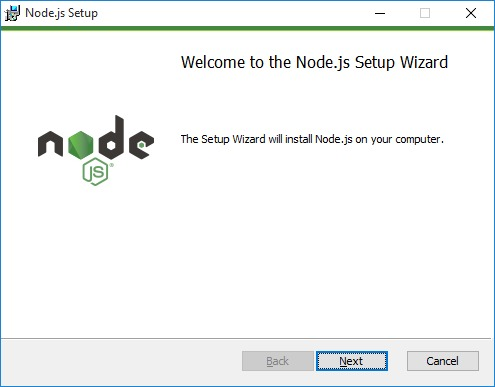


Pada bagian selanjutnya, kita juga dapat melihat komponen apa saja yang akan diterapkan (bundling) dalam pemasangan node.js ini.


Lalu ikuti instruksi selanjutnya dan tunggu proses instalasi hingga selesai. Jika instalasi selesai dan berhasil, maka pesan seperti ini akan tampil.


Untuk memastikan bahwa Node.JS telah terinstal, jalankan perintah berikut di CMD atau PowerShell

```bash
node --version
npm --version
```

> NPM (Node Package Manager) akan otomatis terinstall bersama Node.JS


---

# Membuat akun GitHub

Untuk Anda yang baru pertama kali mendaftar akun GitHub, maka persiapkan terlebih dahulu alamat email yang aktif dan belum pernah digunakan untuk mendaftar GitHub sebelumnya. Alamat email bisa menggunakan google.mail, yahoo, ymail, hotmail, ataupun custom mail.


Masuk ke halaman [github.com](https://github.com) untuk membuka halaman utama, kemudian pilihmenu Sign Up.

Masukkanlah data sesuai dengan yang diminta oleh form pendaftaran. Setiap data yang dimasukkan akan dilakukan pemeriksaan, sehingga semua kolom input harus bercentang hijau agar dapat melanjutkan pendaftaran.


Pada Verify your account, Anda akan diminta untuk menyamakan antara teks perintah dengan gambar yang tampil. Setelah memasukkan username, email, dan password, lanjutkan dengan mengeklik Create account.

Setelah proses pendaftaran akun baru, Anda diminta untuk memasukkan kode unik yang bisa didapatkan dari email. Kode unik tersebut digunakan untuk memverifikasi akun email yang digunakan selama pendaftaran akun GitHub. Bukalah kotak masuk pada email pendaftaran untuk melihat kode tersebut, kemudian masukkanlah ke dalam form pendaftaran tersebut.

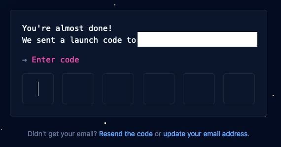 &nbsp;
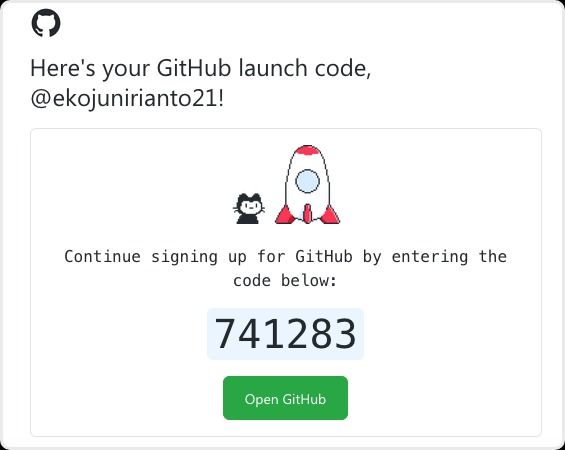

>  Jika kode verifikasi tidak dimasukkan ke dalam form pendaftaran, akun GitHub Anda tidak akan diverifikasi.

Setelah menginput kode verifikasi, Anda akan dihadapkan dengan tampilan selamat datang. Pada halaman tersebut akan ada tiga menu utama yaitu **membuat repository baru**, **membuat organisasi**, dan **mempelajari cara menggunakan GitHub**. Mari kita abaikan terlebih dahulu langkah ini, silakan tekan **Skip this for now** untuk langsung menuju halaman *dashboard*.


Selanjutnya akan diarahkan ke Dashboard.


---

# Instalasi Git

Untuk menginstall Git, pertama kunjungi web [git-scm.com](https://git-scm.com). Secara otomatis akan terdeteksi sistem operasi yang kita gunakan dan versi terbaru Git. Langsung saja klik **Download for Windows**

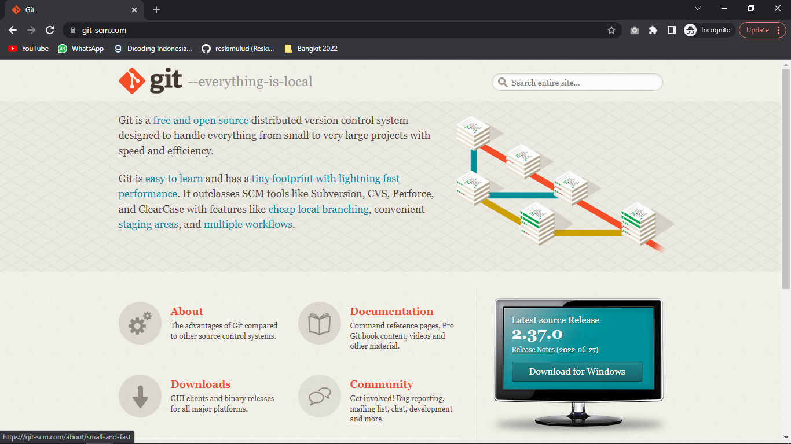

Jalankan file instalasi nya dan ikuti setiap instruksinya


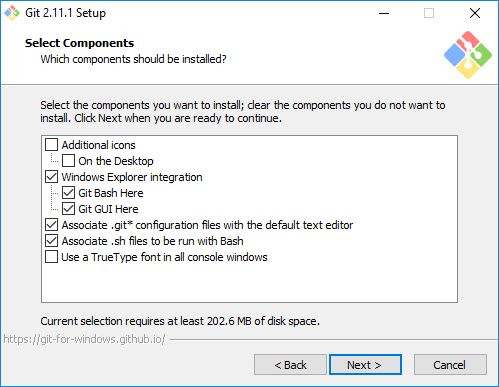


Selanjutnya pengaturan PATH Environment. Pilih yang tengah agar perintah `git` dapat di kenali di Command Prompt (CMD). Setelah itu klik Next.

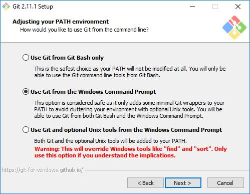

Selanjutnya ikuti seperti langkah-langgkah dibawah


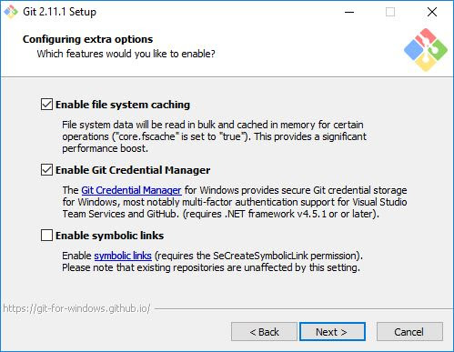


Proses instalasi sedang berjalan, tunggu beberapa saat!

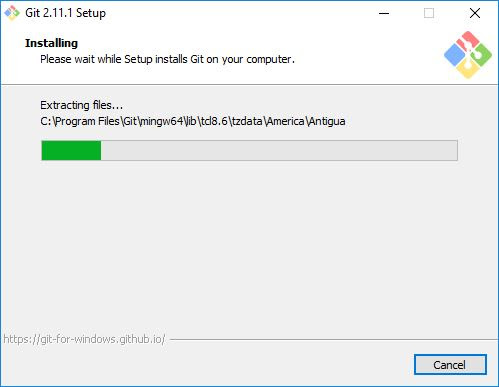

Setelah selesai, langsung klik Finish


Selamat, kamu telah selesai menginstall Git di komputer anda. Untuk memastikan bahwa git sudah terinstall, jalankan perintah berikut

```bash
git --version
```


Selanjutnya lakukan konfigurasi berikut sebelum menggunakan Git yaitu menambahkan email dan nama

```bash
git config --global user.name "Reski Mulud Muchamad"
git config --global user.email "reski.mulud@gmail.com"
```

> **Penting:** Pastikan email yang dimasukan sama dengan email yang terdaftar di GitHub

Selamat. Maka jika sudah melakukan langkah tersebut kita siap menggunakan Git.

---

# Instalasi MySQL

Karena sebelumnya sudah belajar web di mata kuliah Pemrograman Web I dna II, maka saya asumsikan sudah menginstall MySQL menggunakan **XAMPP**. Jangan lupa buka XAMPP nya dan klik `start` untuk MySQL sampai berubah menjadi hijau.

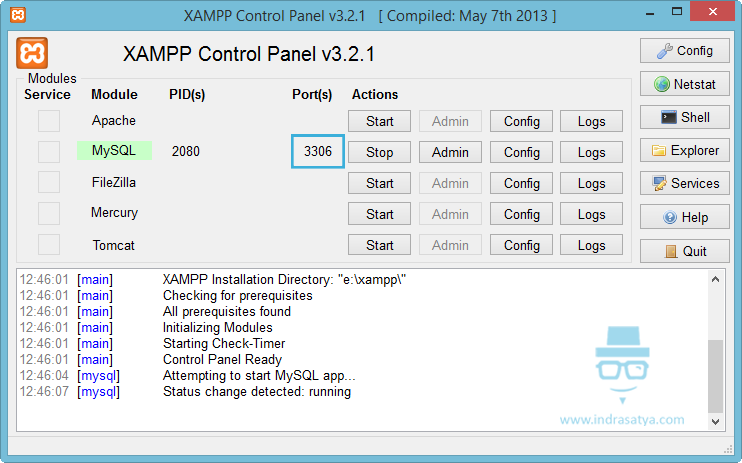

Setelah itu buka [localhost/phpmyadmin](http://localhost/phpmyadmin) di browser, dan kita siap menggunakan MySQL.

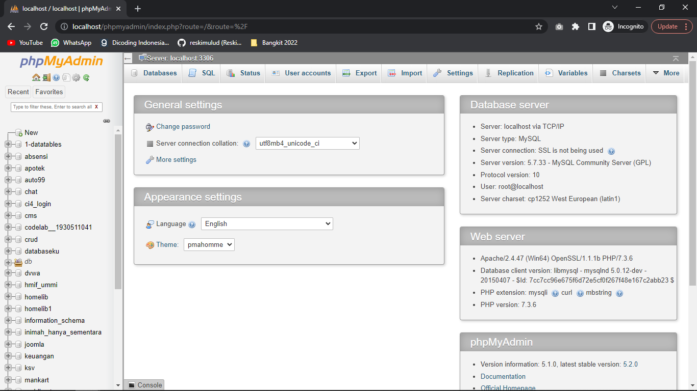

---

# Instalasi Postman

Untuk memasang Postman pada komputer Anda, silakan kunjungi halaman unduh Postman di [postman.com/downloads](https://postman.com/downloads).

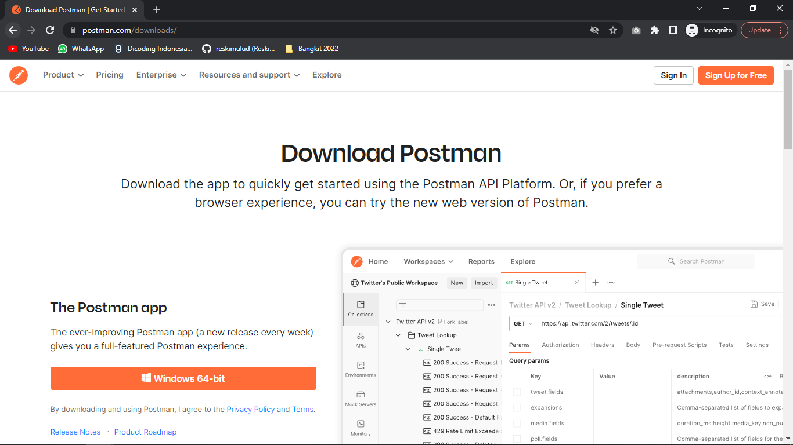

Klik tombol **Windows 64-bit** sesuai tipe bit Windows yang digunakan untuk mulai mengunduh aplikasi Postman. Tunggu hingga proses unduh selesai.

Setelah selesai, buka berkas instalasi Postman untuk memulai proses instalasi.

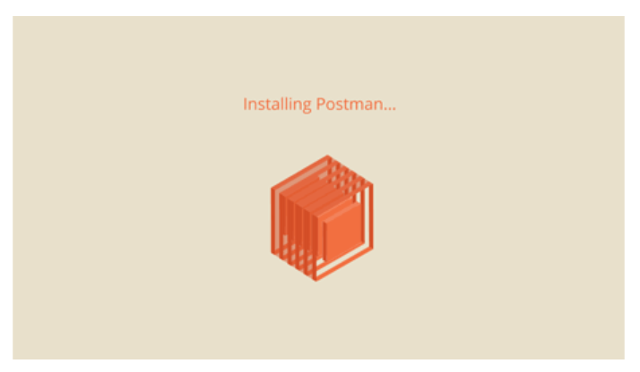

Tunggu hingga proses instalasi selesai. Kemudian aplikasi Postman akan terbuka dengan sendirinya.

Sebelum menggunakannya, Anda ditawari untuk membuat akun Postman. Pendaftaran ini bersifat opsional, Anda bisa mendaftar ataupun melewatinya dengan klik Skip and go to the app.

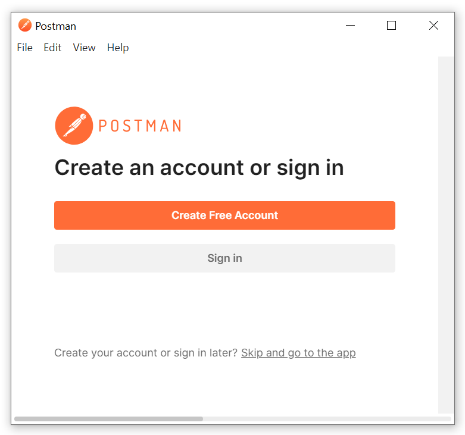

Maka halaman dashboard postman akan terbuka

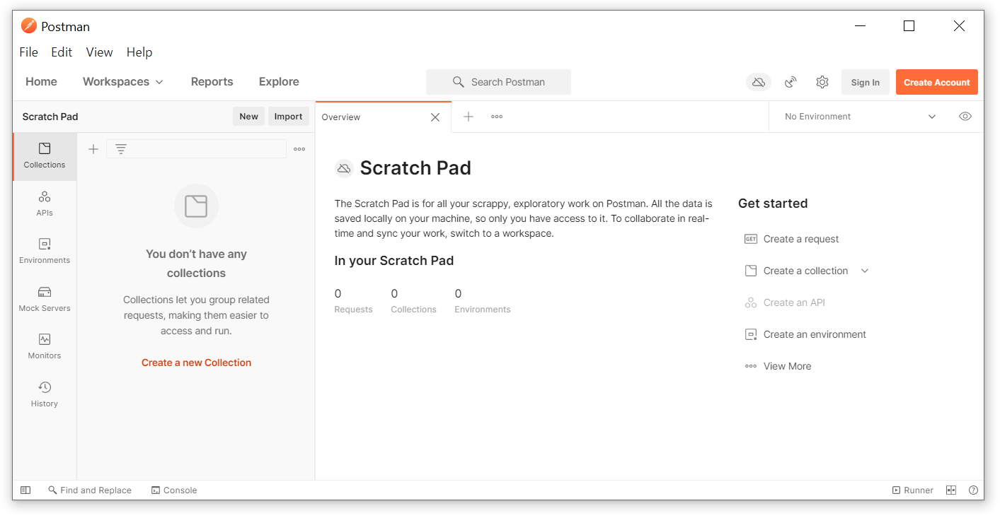

> Untuk penggunaan Postman secara lengkap akan dijelaskan bersamaan dengan penyampaian materi.

---

# Membuat akun Heroku

Jika pertama kali menggunakan Heroku, kita harus mendaftar akun terlebih dahulu. Untuk melakukan registrasi kunjungi halaman utama heroku di [heroku.com](https://heroku.com) dan klik **Sign Up** di pojok kanan atas.

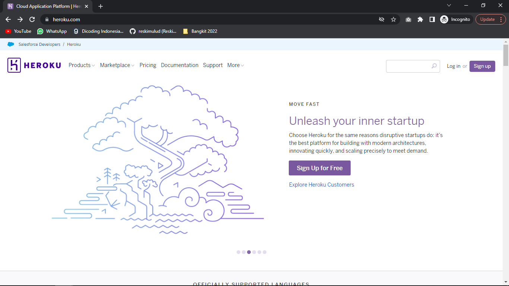

Setelah masuk di Form Pendaftaran, isi sesuai data diri. Dan untuk bagian *Role* pilih saja **Hobbyist** dan pilihan **Primary development language** pilihlah **Node.JS**. Kemudian centang I'm not robot dan klik Create Free Account.

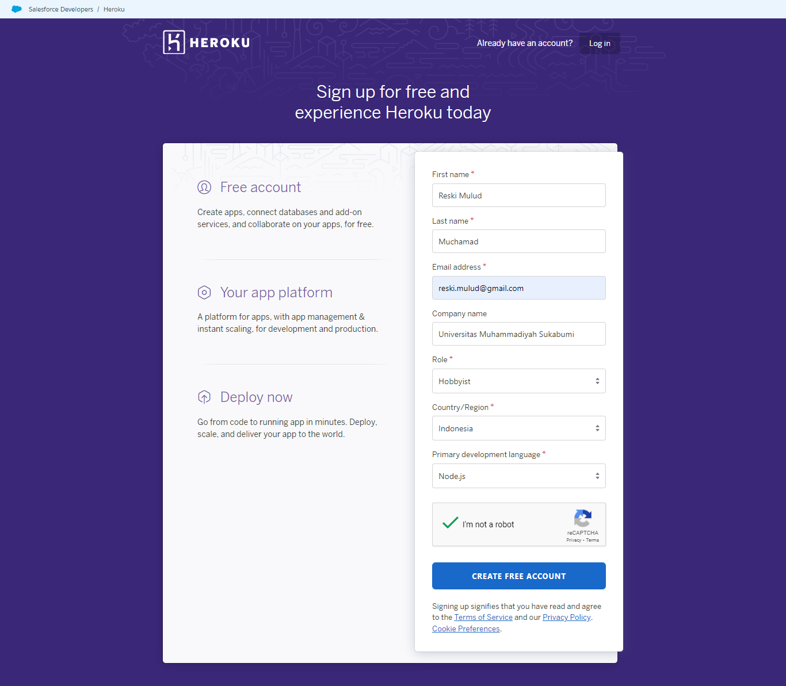

Sesaat setelah itu kita akan ditujukan ke satu pemberitahuan untuk melakukan pengecekan akun yang sudah terdaftar di email. Hal ini berkaitan untuk memverifikasi alamat email dan kebenaran dari akun yang terdaftar di heroku.

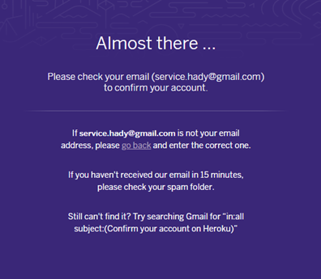

Silahkan check email, kemudian verify akun dengan mengklik tautan pada pesan yang diterima.

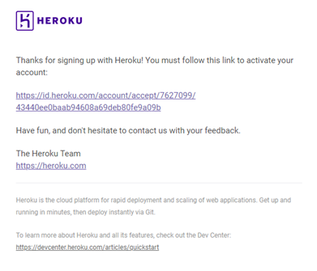

Setelah klik tautan, jangan di close tab tersebut karena kita akan memasukan password untuk login. Silahkan masukan password yang paling aman menurut kamu, tentunya berdasarkan rekomendasi dari heroku.com.

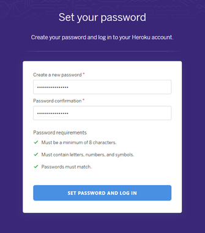

Pada halaman notifikasi silahkan klik tombol “Click here to proceed”, dan selamat anda akan secara otomatis login ke halaman dashboard dari heroku.com

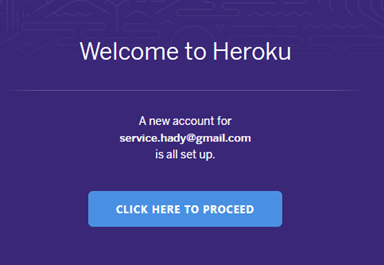

---

# Membuat akun Netlify

Untuk mendaftarkan akun di Netlify, pertama-tama kunjungi websitenya di [app.netlify.com/signup](https://app.netlify.com/signup)

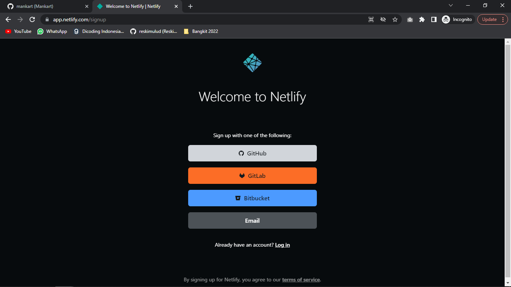

Setelah itu piih Sign Up dengan **GitHub** dan berikan **Authirizatio** Netlify terhadap akun GitHub kalian.
Setelah itu akan muncul halaman Get Started, ikuti seperti gambar di bawah ini


Setelah itu klik **Set up and Continue**, dan jka muncu halaman membuat project, klik **Skip this step for now**. Maka halaman Dashboard akan muncul.

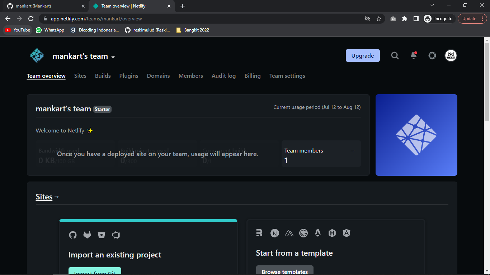

---

# Catatan

Jika sebelumnya telah menginstall beberapa tools di atas maka bisa lewati step tersebut. Dan jika menemukan kendala saat menginstall atau membuat akun langsung hubungi saya atau bisa juga **berikan komentar di Classrom**.

Selamat! Sekarang kita sudah siap untuk memulai membuat hal yang keren saat dikelas nanti, tetap SEMANGAT!!!

---

 **[<< Sebelumnya](pre-requisite.md)** | **[Selanjutnya >>](m1-intro-backend.md)**